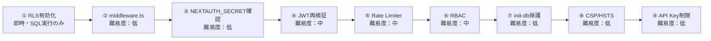

# セキュリティ改善計画

> 作成日: 2026-02-22  
> 最終レビュー: 2026-02-22（プロジェクト全体監査）  
> ステータス: レビュー待ち

本ドキュメントは、システム全体のセキュリティ監査で発見された脆弱性と、その修正方針をまとめたものです。

---

## リスクサマリー

| # | 脆弱性 | 深刻度 | 対応難易度 | ステータス |
|---|---|---|---|---|
| 1 | Rate Limiter がサーバーレスで無効 | 🔴 Critical | 中 | 未着手 |
| 2 | middleware.ts 未設定（認証集中管理なし） | 🔴 Critical | 低 | 未着手 |
| 3 | JWT 再検証なし（無効化ユーザーの即時遮断不可） | 🔴 Critical | 中 | 未着手 |
| 4 | Supabase RLS 未活用（public スキーマ全テーブル） | 🟠 High | 高 | 未着手 |
| 5 | RBAC（認可）が不完全 | 🟠 High | 中 | 未着手 |
| 6 | init-db エンドポイント保護不足 | 🟠 High | 低 | 未着手 |
| 7 | CSP / HSTS ヘッダー欠落 | 🟡 Medium | 低 | 未着手 |
| 8 | NEXTAUTH_SECRET が弱い開発用値 | 🟠 High | 低 | 未着手 |
| 9 | Google Maps API キーのリファラー制限なし | 🟡 Medium | 低 | 未着手 |
| 10 | 一部 API に Rate Limiting 未適用 | 🟡 Medium | 低 | 未着手 |

---

## 1. 🔴 Rate Limiter をサーバーレス対応にする

### 現状の問題

`lib/rate-limit.ts` がインメモリ `Map` を使用しているが、Vercel の Serverless Functions は各リクエストで別インスタンスが起動するため、Rate Limiter が**事実上機能していない**。

### 攻撃シナリオ

- ログインページへのブルートフォース攻撃（パスワード総当たり）
- API大量呼び出しによるDB負荷増大・Supabase課金増

### 修正方針

**Upstash Redis** を導入し、分散環境で動作する Rate Limiter に置き換える。

```bash
npm install @upstash/ratelimit @upstash/redis
```

```typescript
// lib/rate-limit.ts（修正後イメージ）
import { Ratelimit } from '@upstash/ratelimit';
import { Redis } from '@upstash/redis';

const redis = new Redis({
  url: process.env.UPSTASH_REDIS_REST_URL!,
  token: process.env.UPSTASH_REDIS_REST_TOKEN!,
});

export const rateLimiter = new Ratelimit({
  redis,
  limiter: Ratelimit.slidingWindow(100, '1 m'), // 100req/分
});

export const authRateLimiter = new Ratelimit({
  redis,
  limiter: Ratelimit.slidingWindow(5, '1 m'), // 認証: 5req/分
});
```

### 必要な環境変数

- `UPSTASH_REDIS_REST_URL`
- `UPSTASH_REDIS_REST_TOKEN`

---

## 2. 🔴 middleware.ts で認証を集中管理する

### 現状の問題

各APIルートが個別に `requireAuth()` を呼んでいるが、新規ルート追加時に入れ忘れるリスクがある。また、SSRページの保護がほぼない。

### 修正方針

プロジェクトルートに `middleware.ts` を作成し、全ルートを一括保護する。

```typescript
// middleware.ts（新規作成）
export { default } from 'next-auth/middleware';

export const config = {
  matcher: [
    // 認証不要なパスを除外
    '/((?!api/auth|login|_next/static|_next/image|favicon.ico).*)',
  ],
};
```

> **注意**: 各ルートの `requireAuth()` は二重防御としてそのまま残す。

---

## 3. 🔴 JWTコールバックでユーザー状態を再検証する

### 現状の問題

`lib/auth.ts` の JWT コールバックが DB を参照せず、トークン発行時の情報をそのまま使い続ける。ユーザーを無効化（`isActive: false`）しても、**最大7日間アクセスが可能**。

### 修正方針

`jwt` コールバック内で定期的にDBを参照し、ユーザーの状態を検証する。

```typescript
// lib/auth.ts の jwt コールバック修正イメージ
async jwt({ token, user }) {
  if (user) {
    token.id = user.id;
    token.username = user.username;
    token.role = user.role;
    token.assignedProjects = user.assignedProjects;
    token.isActive = user.isActive;
    token.lastVerified = Date.now();
  }

  // 5分ごとにDBで再検証
  const VERIFY_INTERVAL = 5 * 60 * 1000;
  if (Date.now() - (token.lastVerified as number) > VERIFY_INTERVAL) {
    const dbUser = await prisma.user.findUnique({
      where: { id: token.id as string },
      select: { isActive: true, role: true },
    });

    if (!dbUser || !dbUser.isActive) {
      // トークンを無効化
      return { ...token, isActive: false };
    }
    token.role = dbUser.role.toLowerCase();
    token.lastVerified = Date.now();
  }

  return token;
},
```

### maxAge の短縮を検討

現在7日間 → **24時間** に短縮することを推奨。

---

## 4. 🟠 Supabase RLS の活用

### 現状の問題

Prisma が直接DB接続（`DATABASE_URL`）しているため RLS はバイパスされるが、**`NEXT_PUBLIC_SUPABASE_ANON_KEY` はクライアントに公開されている**。この anon key を使って PostgREST 経由で直接テーブルにアクセスされると、**RLS が未設定の全テーブルのデータが取得可能**。

### 影響を受けるテーブル（2026-02-22 監査で確認）

`public` スキーマの全 22 テーブルに RLS が未設定：
- `User`（パスワードハッシュ・時給を含む）
- `ProjectMaster`, `ProjectAssignment`, `AssignmentWorker`, `AssignmentVehicle`
- `Customer`（顧客連絡先）
- `Estimate`, `Invoice`（金額情報）
- `DailyReport`, `DailyReportWorkItem`
- `Worker`, `Vehicle`, `Manager`, `ConstructionType`
- `SystemSettings`, `UnitPriceMaster`, `CompanyInfo`
- `CalendarRemark`, `CellRemark`, `VacationRecord`, `UserSettings`
- `ProjectMasterFile`

### 修正方針

段階的に対応する。

#### Phase 1（即時対応）: 全テーブルの RLS 有効化 + service_role のみ許可

Prisma は `DATABASE_URL` で直接接続するため RLS の影響を受けない。anon key 経由の直接アクセスのみブロックできる。

```sql
-- Supabase SQL Editor で実行
-- ① 全テーブルに RLS を有効化
ALTER TABLE public."User" ENABLE ROW LEVEL SECURITY;
ALTER TABLE public."ProjectMaster" ENABLE ROW LEVEL SECURITY;
ALTER TABLE public."ProjectAssignment" ENABLE ROW LEVEL SECURITY;
ALTER TABLE public."AssignmentWorker" ENABLE ROW LEVEL SECURITY;
ALTER TABLE public."AssignmentVehicle" ENABLE ROW LEVEL SECURITY;
ALTER TABLE public."Customer" ENABLE ROW LEVEL SECURITY;
ALTER TABLE public."Estimate" ENABLE ROW LEVEL SECURITY;
ALTER TABLE public."Invoice" ENABLE ROW LEVEL SECURITY;
ALTER TABLE public."DailyReport" ENABLE ROW LEVEL SECURITY;
ALTER TABLE public."DailyReportWorkItem" ENABLE ROW LEVEL SECURITY;
ALTER TABLE public."Worker" ENABLE ROW LEVEL SECURITY;
ALTER TABLE public."Vehicle" ENABLE ROW LEVEL SECURITY;
ALTER TABLE public."Manager" ENABLE ROW LEVEL SECURITY;
ALTER TABLE public."ConstructionType" ENABLE ROW LEVEL SECURITY;
ALTER TABLE public."SystemSettings" ENABLE ROW LEVEL SECURITY;
ALTER TABLE public."UnitPriceMaster" ENABLE ROW LEVEL SECURITY;
ALTER TABLE public."CompanyInfo" ENABLE ROW LEVEL SECURITY;
ALTER TABLE public."CalendarRemark" ENABLE ROW LEVEL SECURITY;
ALTER TABLE public."CellRemark" ENABLE ROW LEVEL SECURITY;
ALTER TABLE public."VacationRecord" ENABLE ROW LEVEL SECURITY;
ALTER TABLE public."UserSettings" ENABLE ROW LEVEL SECURITY;
ALTER TABLE public."ProjectMasterFile" ENABLE ROW LEVEL SECURITY;

-- ② anon key では一切アクセスできないようにする（ポリシーなし = 全拒否）
-- service_role は RLS をバイパスするため、supabaseAdmin クライアントは引き続き動作する
```

> **重要**: RLS を有効化してポリシーを作成しなければ、anon key での全アクセスが拒否される。Prisma（直接 DB 接続）や `supabaseAdmin`（service_role key）は影響を受けない。

#### Phase 2: Supabase Storage のバケットポリシーを確認・強化

#### Phase 3: 将来的に Supabase Auth 統合を検討

---

## 5. 🟠 RBAC（ロールベースアクセス制御）を全APIに適用

### 現状の問題

`users/route.ts` 以外のAPIルートに権限チェックがない。`worker` ロールのユーザーでも請求書の作成・削除が可能。

### 修正方針

各機能に必要な権限レベルを定義し、API毎に適用する。

```typescript
// utils/permissions.ts に追加するイメージ
export const PERMISSIONS = {
  // 閲覧系：全ロール
  viewCalendar: ['admin', 'manager', 'worker'],
  viewAssignments: ['admin', 'manager', 'worker'],

  // 編集系：admin + manager
  manageProjects: ['admin', 'manager'],
  manageInvoices: ['admin', 'manager'],
  manageEstimates: ['admin', 'manager'],
  manageCustomers: ['admin', 'manager'],

  // 管理系：admin のみ
  manageUsers: ['admin'],
  systemSettings: ['admin'],
} as const;
```

### 対象ルート（優先順）

1. `invoices/` — 金銭に直結
2. `estimates/` — 見積金額の改ざんリスク
3. `project-masters/` — 契約金額の閲覧・変更
4. `customers/` — 顧客情報保護
5. `daily-reports/` — 他者の日報の変更防止

---

## 6. 🟠 init-db エンドポイントの保護強化

### 現状の問題

`NODE_ENV` のみで制御しており、設定ミスで本番環境でも有効化されるリスクがある。

### 修正方針

```typescript
// app/api/init-db/route.ts 修正イメージ
export async function POST(req: NextRequest) {
  // 二重の安全策
  if (process.env.NODE_ENV === 'production') {
    return NextResponse.json({ error: '...' }, { status: 403 });
  }

  // API秘密鍵での認証を追加
  const apiKey = req.headers.get('x-init-api-key');
  if (apiKey !== process.env.INIT_DB_SECRET) {
    return NextResponse.json({ error: '認証エラー' }, { status: 401 });
  }

  // ... 既存処理
}
```

必要な環境変数: `INIT_DB_SECRET`（開発環境のみ設定）

---

## 7. 🟡 セキュリティヘッダーの追加

### 現状の問題

`next.config.js` に `Content-Security-Policy` と `Strict-Transport-Security` がない。

### 修正方針

`next.config.js` の headers に追加：

```javascript
{ key: 'Strict-Transport-Security', value: 'max-age=63072000; includeSubDomains; preload' },
{ key: 'Content-Security-Policy', value: "default-src 'self'; script-src 'self' 'unsafe-inline' 'unsafe-eval'; style-src 'self' 'unsafe-inline'; img-src 'self' data: https://*.supabase.co; connect-src 'self' https://*.supabase.co" },
```

> **注意**: CSP は導入後に動作確認が必要。制限が厳しすぎると既存機能が壊れるため、段階的に適用する。

CSP の推奨値（Google Maps 等の外部リソースを考慮）:

```javascript
// next.config.js headers 内に追加
{
    key: 'Content-Security-Policy',
    value: [
        "default-src 'self'",
        "script-src 'self' 'unsafe-eval' 'unsafe-inline' https://maps.googleapis.com",
        "style-src 'self' 'unsafe-inline' https://fonts.googleapis.com",
        "img-src 'self' data: blob: https://*.supabase.co https://maps.googleapis.com https://maps.gstatic.com",
        "font-src 'self' https://fonts.gstatic.com",
        "connect-src 'self' https://*.supabase.co wss://*.supabase.co https://maps.googleapis.com",
        "frame-src 'none'",
    ].join('; '),
},
```

---

## 8. 🟠 NEXTAUTH_SECRET が弱い開発用値

### 現状の問題

`.env` ファイルの `NEXTAUTH_SECRET` が `"development-secret-key-change-in-production-12345"` という推測可能な値になっている。この値が本番に適用された場合、JWT の偽造が可能。

### 確認済み事項

- `.env` は `.gitignore` に含まれており、Git 履歴にもコミットされていない ✅
- `.env.local` には別のシークレットが設定されている ✅

### 修正方針

1. Vercel の本番環境変数で強力なランダム値が設定されていることを確認
2. `.env` の値をプレースホルダーに変更

```diff
-NEXTAUTH_SECRET="development-secret-key-change-in-production-12345"
+NEXTAUTH_SECRET="change-me-generate-with-openssl-rand-base64-32"
```

---

## 9. 🟡 Google Maps API キーのリファラー制限

### 現状の問題

`NEXT_PUBLIC_GOOGLE_MAPS_API_KEY` はクライアントに公開される（`NEXT_PUBLIC_` プレフィックス）。Google Cloud Console でリファラー制限がないと、第三者にキーを悪用される可能性がある。

### 修正方針

Google Cloud Console → API キーの制限 で以下を設定：

- **アプリケーション制限**: HTTP リファラー
- **許可リファラー**:
  - `yusystem.vercel.app/*`
  - `localhost:3001/*`
- **API 制限**: Maps JavaScript API のみ

---

## 10. 🟡 一部 API に Rate Limiting が未適用

### 現状の問題

`daily-reports/route.ts` では `applyRateLimit` が呼ばれていない。他にも適用漏れがある可能性がある。

### 修正方針

全 API ルートに統一的に `applyRateLimit` を適用する。middleware.ts 導入時に一括適用することも可能。

```typescript
// app/api/daily-reports/route.ts 修正
export async function GET(request: NextRequest) {
    const rateLimitError = applyRateLimit(request, RATE_LIMITS.api);
    if (rateLimitError) return rateLimitError;
    // ... 既存処理
}
```

---

## 推奨対応順序



**最短で最大効果**: ① RLS 有効化（SQL 実行のみで即完了）→ ② middleware.ts → ③ NEXTAUTH_SECRET 確認の順で、最も危険な攻撃経路を素早く塞げます。

---

## ✅ セキュリティ上の良い実装（2026-02-22 監査で確認）

| 項目 | 状態 |
|------|------|
| パスワードの bcrypt ハッシュ化（salt rounds: 10） | ✅ |
| 全 API ルートに `requireAuth()` 適用（40+ ルート） | ✅ |
| RBAC（5段階ロール定義: admin/manager/foreman1/foreman2/worker） | ✅ |
| セキュリティヘッダー（X-Frame-Options, X-Content-Type-Options 等） | ✅ |
| `.env` / `.env.local` の `.gitignore` 設定 | ✅ |
| Git 履歴に `.env` 未コミット | ✅ |
| XSS 対策（React 自動エスケープ、`dangerouslySetInnerHTML` 不使用） | ✅ |
| Zod によるバリデーション（主要 API） | ✅ |
| 本番ソースマップ無効化 | ✅ |
| init-db の本番環境無効化 | ✅ |

---

## 参考リンク

- [NextAuth.js Middleware](https://next-auth.js.org/configuration/nextjs#middleware)
- [Upstash Rate Limiting](https://upstash.com/docs/oss/sdks/ts/ratelimit/overview)
- [Next.js Security Headers](https://nextjs.org/docs/app/api-reference/next-config-js/headers)
- [Supabase RLS Guide](https://supabase.com/docs/guides/auth/row-level-security)
- [Google Maps API Key Restrictions](https://developers.google.com/maps/api-security-best-practices)
