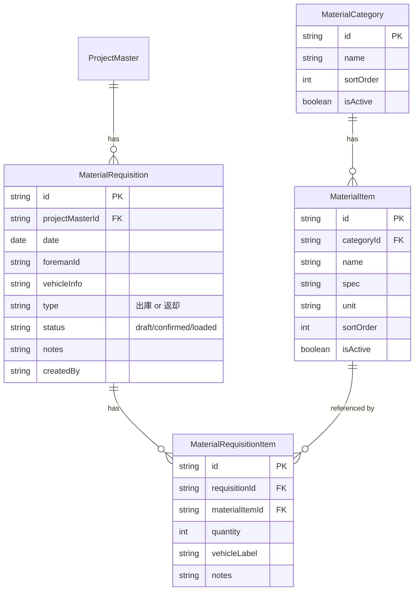

# 材料管理システム — 5人の専門家による会議議事録

> **議題**: 現場の材料積込み伝票（紙ベース）をDandoLinkシステムに組み込む方法  
> **日付**: 2026-03-24

---

## 👥 参加者（5人の専門家）

| # | 役割 | 専門領域 |
|---|------|---------|
| 1 | **現場監督（佐藤）** | 足場施工・材料管理の実務20年 |
| 2 | **システムアーキテクト（田中）** | Next.js/Supabase/Prismaのシステム設計 |
| 3 | **業務改善コンサルタント（鈴木）** | 建設業DX・業務フロー最適化 |
| 4 | **UXデザイナー（山田）** | モバイルファースト・現場向けUI設計 |
| 5 | **経営分析（高橋）** | 原価管理・材料コスト分析 |

---

## 🔍 現状の課題整理

**佐藤（現場監督）**:
> 今の流れは、職長が写真や図面を見て必要な材料の種類と数量を紙に書き出し、トラックに積み込んでいる。この紙には足場の部材が全部リストアップされている。柱（3.6m～0.9切）、手摺（1.8m～イボ0.6）、400アンチ、250ハーフ、筋交、ブラケット、ピン付き、階段、ジャッキ、単管、クランプ、鉄骨、ネット類、先行手摺、梁枠、道板、巾木など。**問題は、紙だとどの現場にどれだけ材料を出したか後から追えないこと。在庫把握もできない。**

**鈴木（コンサルタント）**:
> 要するに、(1) **材料出庫伝票のデジタル化** と (2) **現場別の材料使用量トラッキング** と (3) **在庫管理** の3つの課題が混在している。一気に全部やると複雑になる。段階的に進めるべき。

---

## 🗣️ 議論

### ■ 第1ラウンド：何を最優先で組み込むか

**佐藤（現場監督）**:
> まず紙の伝票をそのままアプリで入力できるようにしてほしい。朝、職長が紙に書いている内容をスマホかタブレットで入力して、それがそのまま積込みリストになるのが理想。

**山田（UXデザイナー）**:
> 待ってください。この紙、100種類以上の部材がリストアップされている。全部を一から入力させるのは現実的じゃない。**紙のフォーマットをそのままデジタル化するのではなく、よく使う部材を素早く選んで数量だけ入力できるUIにすべき。**

**田中（アーキテクト）**:
> 同感。技術的にも、紙のレイアウトをそのままWeb画面に移すのは保守性が悪い。**材料マスターテーブルを作って、カテゴリ別に部材を管理し、出庫伝票は現場・日付・車両に紐づける設計がいい。**

**佐藤（現場監督）**:
> でも職長たちはITが苦手な人が多い。今の紙のレイアウトに慣れているから、見た目が全く違うと使ってもらえない可能性がある。

**山田（UXデザイナー）**:
> それは大事な指摘。**紙のカテゴリ構造（柱→サイズ別、手摺→サイズ別...）は維持しつつ、タップで展開して数量入力する形にする。** 紙と同じ順番・同じ分類で表示すれば、職長も違和感なく移行できる。

**鈴木（コンサルタント）**:
> まとめると、**Phase 1は「材料出庫伝票のデジタル化」に絞る**。これだけで価値がある。在庫管理はPhase 2。

> [!IMPORTANT]
> **全員合意**: まず材料出庫伝票のデジタル化から始める。在庫管理は後。

---

### ■ 第2ラウンド：データモデル設計

**田中（アーキテクト）**:
> 既存のDandoLinkのスキーマを見ると、`ProjectMaster`（案件）と`ProjectAssignment`（配車・配員）がある。材料出庫は **Assignmentに紐づける** のが自然。「この日、この現場に、このトラックで、この材料を持っていった」というデータになる。

**高橋（経営分析）**:
> ちょっと待って。材料の出庫は**案件単位**で集計したい。「A邸に合計で柱3.6mを何本出した」を知りたい。Assignmentに紐づけるのは粒度として正しいけど、集計は`ProjectMaster`単位でできるようにしてほしい。

**田中（アーキテクト）**:
> もちろん。Assignment → ProjectMaster のリレーションは既にあるから、集計は問題ない。提案するデータモデルは以下：

```
MaterialCategory（材料カテゴリ）
  - id, name, sortOrder, isActive
  例: 柱、手摺、400アンチ、単管、クランプ ...

MaterialItem（材料品目）
  - id, categoryId, name, spec, unit, sortOrder, isActive
  例: 柱-3.6m、柱-2.7m、単管-6m、クランプ-直交 ...

MaterialRequisition（材料出庫伝票）
  - id, projectMasterId, date, vehicleId?, foremanId, 
    status(draft/confirmed/loaded), notes, createdBy

MaterialRequisitionItem（出庫伝票明細）
  - id, requisitionId, materialItemId, quantity, notes
```

**佐藤（現場監督）**:
> 紙の伝票には「車両」が3列ある。1回の出庫で複数台のトラックに積むこともある。車両ごとに何を積んだか分けられるようにしてほしい。

**田中（アーキテクト）**:
> なるほど。それなら `MaterialRequisition` を車両単位にするか、伝票の中に車両の区分を入れるか…

**鈴木（コンサルタント）**:
> 現場の実態としては、**1枚の伝票が1出庫イベント**（＝1日の1現場向けの積込み全体）で、その中に複数車両がある、という認識でいいですか？

**佐藤（現場監督）**:
> そう。朝、職長が「今日のA邸向け」で1枚書いて、トラック2台に分けて積む。

**田中（アーキテクト）**:
> では修正します：

```
MaterialRequisition（材料出庫伝票）  ← 1現場・1日に1枚
  - id, projectMasterId, date, foremanId,
    status, notes, createdBy

MaterialRequisitionVehicle（車両別積込み）
  - id, requisitionId, vehicleId?, vehicleName, sortOrder

MaterialRequisitionItem（出庫伝票明細）
  - id, requisitionId, vehicleId（どの車両に積んだか）,
    materialItemId, quantity, notes
```

> [!TIP]
> `vehicleId` を nullable にすることで、車両に紐づけず単純に数量だけ入力するシンプル運用も可能。

**高橋（経営分析）**:
> このモデルなら、以下の集計ができる：
> - **現場別の材料使用量**：`ProjectMasterId` でグループ化
> - **日別の出庫量**：`date` でグループ化
> - **車両別の積載量**：`vehicleId` でグループ化
> - **材料品目別の使用トレンド**：`materialItemId` でグループ化

> [!IMPORTANT]
> **全員合意**: 上記のデータモデルで進める。

---

### ■ 第3ラウンド：UI/UXの設計方針

**山田（UXデザイナー）**:
> UIは**3つの画面**が必要：

#### 画面1: 材料出庫伝票 入力画面（職長が使う）

```
┌─────────────────────────────────┐
│ 材料出庫伝票                      │
│ 現場: [A邸 足場組立]              │
│ 日付: [2026-03-24]               │
│ 車両: [2tトラック①] [4tトラック②]  │
├─────────────────────────────────┤
│ ▼ 柱                            │
│   3.6m  [___] 本                │
│   2.7m  [___] 本                │
│   1.8m  [___] 本                │
│   0.9m  [___] 本                │
│ ▼ 手摺                          │
│   1.8m  [___] 本                │
│   1.2m  [___] 本                │
│   ...                           │
│ ▼ 単管                          │
│   6m    [___] 本                │
│   ...                           │
└─────────────────────────────────┘
```

- カテゴリはアコーディオン式で展開/折りたたみ
- 紙の伝票と同じ並び順を維持
- **数量が0のものはグレーアウト**して視認性向上
- テンキーパッドで数量をタップ入力（モバイル最適化）

#### 画面2: 出庫履歴一覧（管理者が使う）

```
┌──────────────────────────────────────┐
│ 材料出庫履歴                          │
│ 期間: [3月1日] ～ [3月24日]           │
│ 現場: [全て ▼]                       │
├──────────────────────────────────────┤
│ 3/24 A邸 足場組立  田中班  確定済み    │
│ 3/24 B邸 足場解体  佐藤班  下書き      │
│ 3/23 C邸 足場組立  鈴木班  確定済み    │
│ ...                                  │
└──────────────────────────────────────┘
```

#### 画面3: 現場別 材料集計レポート（経営者が使う）

```
┌──────────────────────────────────────┐
│ A邸 材料使用状況                      │
│ 期間: 2026年 全体                    │
├──────────────────────────────────────┤
│ 材料         | 出庫合計 | 返却合計     │
│ 柱 3.6m     |    50本 |    48本      │
│ 柱 2.7m     |    30本 |    28本      │
│ 手摺 1.8m   |   120本 |   118本      │
│ ...         |         |             │
└──────────────────────────────────────┘
```

**佐藤（現場監督）**:
> 返却のことも考えてくれているなら、出庫と返却を区別する必要がある。足場解体の時に材料を引き上げるから。

**鈴木（コンサルタント）**:
> Phase 1では**出庫のみ**。返却はPhase 2で「返却伝票」として追加する方が混乱しない。ただしデータモデルには `type: "出庫" | "返却"` のフィールドを最初から入れておくのが良い。

**山田（UXデザイナー）**:
> 同意。もう一つ重要なのは、**テンプレート機能**。同じ種類の現場（例：一般住宅の足場組立）なら、使う材料はだいたい同じ。前回の伝票をコピーして数量だけ調整できるようにすべき。

**佐藤（現場監督）**:
> それは助かる！今も前の紙をコピーして使い回すことが多い。

> [!IMPORTANT]
> **全員合意**: UIは紙の伝票のカテゴリ構造を踏襲。テンプレート/コピー機能は必須。

---

### ■ 第4ラウンド：既存システムとの連携

**田中（アーキテクト）**:
> 既存のDandoLinkとの連携ポイントを整理する：

| 連携先 | 連携方法 |
|-------|---------|
| `ProjectMaster`（現場） | 出庫伝票に `projectMasterId` で紐づけ |
| `ProjectAssignment`（配車） | 配車カレンダーから「材料出庫伝票作成」ボタン |
| `Vehicle`（車両マスター） | 車両選択時に既存マスターを参照 |
| `DailyReport`（日報） | 日報に「使用材料」セクション追加（将来） |
| `Worker / User`（職長） | 伝票の記入者として紐づけ |

**鈴木（コンサルタント）**:
> 特に重要なのは**配車カレンダーとの連携**。今のフローは：
> 1. カレンダーで配車を確認
> 2. 紙に材料を記入
> 3. トラックに積込み
>
> これをデジタルにすると：
> 1. カレンダーで配車を確認
> 2. **その配車から材料出庫伝票を作成**（現場・日付・車両が自動入力）
> 3. 材料の数量を入力
> 4. 積込みチェック（任意）

**高橋（経営分析）**:
> この仕組みが入ると、**案件ごとの材料コスト**が見えるようになる。現在 `ProjectMaster` に `materialCost` フィールドがあるが手入力。将来的にはここを自動計算できる。材料マスターに単価を持たせれば：
>
> `案件の材料費 = Σ（出庫数量 × 材料単価）`
>
> 見積書との照合もできるようになる。

---

### ■ 第5ラウンド：実装フェーズの策定

**全員で合意した段階的実装計画：**

#### Phase 1: 材料マスター & 出庫伝票（MVP）— 2-3週間

| タスク | 内容 |
|-------|------|
| 材料カテゴリ・品目マスター | 紙の伝票の部材リストをすべてマスター化 |
| マスター管理画面 | カテゴリ・品目の追加/編集/並び替え |
| 出庫伝票 入力画面 | アコーディオン式の数量入力UI |
| 出庫伝票 一覧・詳細画面 | 検索・フィルタ付き |
| API (CRUD) | 伝票の作成・読取・更新・削除 |

#### Phase 2: レポート & 返却 — 1-2週間

| タスク | 内容 |
|-------|------|
| 現場別 材料集計レポート | 出庫量を現場ごとに集計表示 |
| 返却伝票 | 解体時の材料返却を記録 |
| カレンダー連携 | 配車から直接伝票作成 |

#### Phase 3: 在庫管理 — 2-3週間

| タスク | 内容 |
|-------|------|
| 在庫マスター | 倉庫の初期在庫登録 |
| リアルタイム在庫 | 出庫/返却で自動増減 |
| 在庫アラート | 在庫不足時の警告 |
| 材料コスト | 材料に単価を持たせ原価計算連動 |

---

## ✅ 最終結論

5人の専門家による結論を以下にまとめる。

### 基本方針

1. **段階的に導入する** — 一度に全部作らない。Phase 1（出庫伝票のデジタル化）だけで現場に大きな価値がある
2. **紙の伝票の構造を踏襲する** — 職長がITに不慣れでも違和感なく使えるカテゴリ順・レイアウト
3. **既存のシステムと自然に連携する** — 案件マスター・配車カレンダー・車両マスターとのリレーション

### データモデル（合意）



### 期待される効果

| 効果 | 説明 |
|-----|------|
| 📊 **現場別の材料使用量の可視化** | どの現場にどれだけの材料を投入したか一目瞭然 |
| 📦 **在庫の正確な把握**（Phase 3） | 出庫・返却記録から倉庫在庫をリアルタイム計算 |
| 💰 **原価管理の精緻化** | 材料費を案件別に自動集計、見積との乖離を把握 |
| ⏱️ **積込み作業の効率化** | デジタル伝票で漏れ・重複を削減 |
| 📱 **ペーパーレス化** | 紙の管理・紛失リスクを排除 |

### DandoLinkのプロダクト価値向上

> [!NOTE]
> ロードマップの「将来検討」にある**足場積算**と密接に関連。材料マスターを整備することで、将来的に図面からの自動積算機能にも展開可能。競合（ANDPAD, KANNA）にはない**足場業界特化の材料管理**は、強力な差別化要因になる。

---

## 📎 参考：紙の伝票の材料カテゴリ（初期マスターデータ案）

| カテゴリ | 品目（spec） |
|---------|-------------|
| 柱 | 3.6m, 2.7m, 1.8m, 0.9m, 調整, 1コマ, 0.9切 |
| 手摺 | 1.8m, 1.2m, 0.9m, 0.6m, 0.4m, 0.3m, 0.2m, サイド, イボ0.6 |
| 400アンチ | 1.8m, 1.2m, 0.9m, 0.6m |
| 250ハーフ | 1.2m, 0.9m, 0.6m |
| センターハーフ | 0.4m, 1.8m, 1.2m, 0.9m, 0.6m |
| 筋交 | 1.8m, 1.2m, 0.9m |
| ブラケット | 0.4m, 0.8m, 0.6m |
| ピン付き | 0.4m, 0.2m |
| 階段 | 鉄, アルミ, 3段, 階段下 |
| ジャッキ | 固定, 下屋 |
| 皿 / 兼用皿 | - |
| ルーフベース | - |
| 単管 | 6m, 5m, 4m, 3m, 2m, 1.5m, 1m, 0.5m |
| クランプ | 直交, 自在, 3連, シート, 養生 |
| 鉄骨 | 直交, 自在 |
| ジョイント | - |
| 単管ベース | - |
| ネット | 新素用 青(紐付), グレー5.4・6.3, 青 黒 緑, 白 |
| カヤシート | - |
| ヒモ | - |
| 壁つなぎ | 14～17, 19～24, 24～34, 33～52, 50～72, 70～92 |
| 道板 | 4m, 3m, 2m, 1m |
| 巾木（木製） | 4m, 2m |
| L型巾木 | 1.8m, 1.2m, 0.9m, 0.6m |
| L型巾木（養用） | 0.9m, 0.6m |
| アダプター | 柱用, アンチ |
| ジャッキカバー | - |
| コッパ | - |
| チョウチョ | - |
| 先行手摺 | 1.8m, 1.2m, 0.9m, 0.6m |
| 梁枠 | 3.6m, 5.4m |
| 安全バー | - |
| 金網 | - |
| 杭 | - |
| ローリングタイヤ | - |
| ハッチ付きアンチ | - |
| タラップ | - |
| 朝顔 | - |
| 単クランプ | - |
| 羽子板クランプ | - |
| 親綱 | (m指定) |
| 足場表示看板 | - |
| イメージシート | (サイズ指定) |
| ラッセルネット | - |
| 階段手摺 | - |
| レール | - |
| 養生カバー | 大, 小 |
| 番線 | 巾木・巻き |
| 扉 | - |
| リース品 | - |
